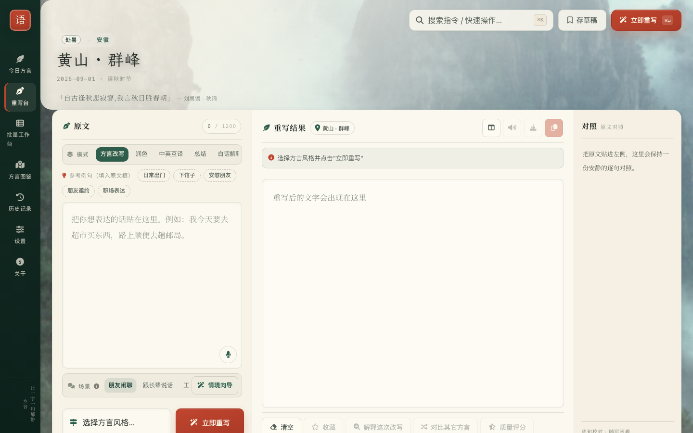
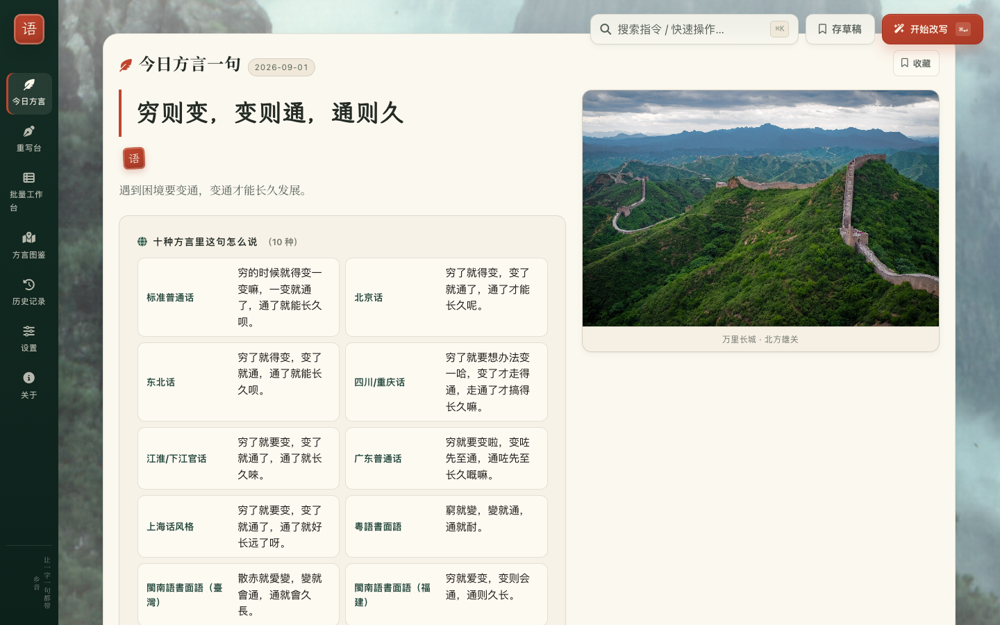
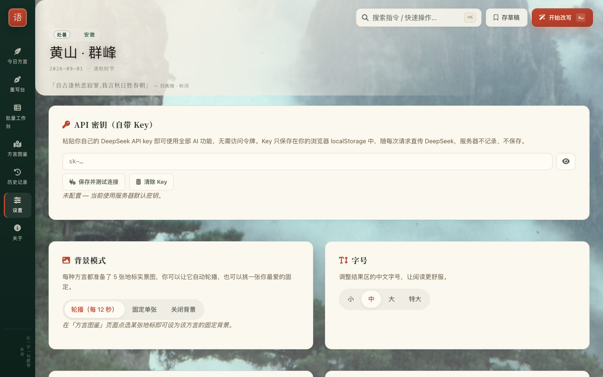

# 地道中文 · Native Chinese Grammar Assistant (NCGA)

把书面普通话,改写成十种真实的中文方言口感 — 北京、东北、川渝、江淮、广普、上海话风格、粤语书面语、台湾/福建闽南语。
Rewrite standard Mandarin into how people actually talk — 10 regional Chinese varieties, with dialect quality that is *measured and gated*, not vibes.



## 是什么

一个本地优先的网页应用:粘贴一句书面中文,选一个方言,得到一句像当地人写出来的话。不是词替换 — 语气、语序、句末助词整体到位。任何语言的输入都可以,输出始终是你选的中文方言。

A local-first web app: paste textbook Mandarin (or English/Japanese/French — output stays Chinese), pick a variety, get back a sentence that reads like a local wrote it. Register, word order, and sentence-final particles move together, not just vocabulary.

## 为什么不一样

- **方言质量是门禁,不是玄学** — 每种方言带 golden 评测集 + 锚定 LLM 评审;任何改动让任一方言掉分 >0.3 直接失败(见 [方言质量评估协议](#方言质量评估协议-2026-08))。Dialect quality is a CI gate: golden sets + an anchored judge, regressions fail the build.
- **按方言路由模型** — 官话系走 DeepSeek V4 Flash(快、便宜),低资源方言(江淮/上海话风格/粤语书面/闽南语)自动路由到 Pro;响应带 `model` 字段,路由可观测。依据:[一次 A/B 实验](#方言改写的模型路由-2026-08)。
- **BYOK 自带 Key** — 设置页粘贴你自己的 DeepSeek key,全部 AI 功能走你的账户,无需访问令牌;key 只存浏览器 localStorage,随请求直传上游。见 [自带 Key(BYOK)](#自带-keybyok)。
- **诚实降级** — LLM 抖动时回退本地启发式改写,UI 与 API 都明示 `degraded: true`,不装没发生。
- **近乎零依赖** — 后端 Python 3.10+ 标准库(运行时仅 `certifi` + `cryptography`),前端原生 HTML/CSS/JS 无构建步骤。

还有:流式改写 · 批量工作台(100 条 × 4 方言)· 情境向导(两句话生成语域画像)· 每日方言一句配地标摄影 · 润色/中英互译/总结/白话解释 · 实时质量面板。

| 每日方言一句 | 自带 Key 设置 |
| --- | --- |
|  |  |

## 快速开始

```bash
pip install -r requirements.txt        # 仅运行
pip install -r requirements-dev.txt    # 开发 / 测试 / 生产 server

cp .env.example .env                   # 填入 DEEPSEEK_API_KEY
python app.py                          # http://127.0.0.1:8000
```

没有 API key 也能跑 — 方言改写回退启发式(并明示降级);有 key 但不想给别人用?开 `NCGA_AUTH_TOKEN` 即可(见 [安全](#安全--security))。

## 测试与质量门禁

```bash
pytest                                  # 离线测试(LLM 全部 mock),含 Playwright 浏览器用例
tools/smoke.sh                          # 真 LLM 冒烟(19 项,每次几分钱),发布前必跑
python3 tools/eval_dialects.py          # 方言质量回归:任一方言掉分 >0.3 即 exit 1
```

## 文档地图

- [环境变量全表](#环境变量) · [语料库 few-shot](#语料库与少样本注入-cycle-22-stage-c) · [词音表 lexicon](#词音对应表-lexicon-cycle-22-stage-d)
- [文本变换 API(润色/互译/总结/解释)](#cycle-23--文本变换-api) · [模型路由](#模型路由)
- [生产部署(waitress/Docker)](#生产部署) · [安全清单](#安全--security) · [架构速览](#架构速览) · [加一种新方言](#加一种新方言)

---

## 运行

```bash
pip install -r requirements.txt        # 仅运行
pip install -r requirements-dev.txt    # 开发 / 测试 / 生产 server

cp .env.example .env                   # 填入 DEEPSEEK_API_KEY
python app.py                          # http://127.0.0.1:8000
```

- 后端:Python 3.10+。运行时依赖仅 `certifi` + `cryptography`(AES-GCM 落盘加密;见 `requirements.txt`)。WSGI。
- 前端:原生 JS / CSS / HTML,无构建步骤。
- LLM:默认 DeepSeek(OpenAI 兼容协议),可切换。LLM 不可用时**方言改写**回退到本地启发式重写并明示降级;**文本变换**(Cycle 23)无启发式回退,直接返回 503。

## 环境变量

| 变量 | 默认 | 说明 |
| --- | --- | --- |
| `LLM_PROVIDER` | `deepseek` | `deepseek` 或 `openai` |
| `LLM_API_KEY` 或 `DEEPSEEK_API_KEY` | — | LLM API key(缺省走启发式 fallback) |
| `LLM_MODEL` | `deepseek-chat` / `gpt-4.1-mini` | 模型名 |
| `LLM_MODEL_<MODE>` | 仅 `explain` 在 deepseek 下默认 `deepseek-v4-pro` | Cycle 23: 按变换模式覆盖模型,见 [模型路由](#模型路由) |
| `LLM_BASE_URL` | provider 默认 | OpenAI 兼容 base URL |
| `LLM_STREAM` | `true` | 是否使用 SSE 流式 |
| `LLM_TIMEOUT_SECONDS` | `60` | 整个请求的超时上限(秒) |
| `LLM_CA_BUNDLE` | `certifi.where()` | 自定义 CA 文件路径 |
| `LLM_SKIP_SSL_VERIFY` | `false` | **危险**:跳过 SSL 校验,仅供调试 |
| `NCGA_RATE_LIMIT_PER_MIN` | `30` | 每个 IP 每分钟的主限流桶(`/api/rewrite` 与三个 transform POST 端点等共享;`GET /api/transform-modes` 不限流;0 = 关闭) |
| `NCGA_MAX_BODY_BYTES` | `65536` | 请求体字节上限(64 KB,容纳 batch 输入) |
| `NCGA_BATCH_RATE_LIMIT_PER_MIN` | `6` | 每个 IP 每分钟可调 `/api/rewrite-batch` 的次数 |
| `NCGA_DAILY_LLM_CAP_PER_IP` | `300` | 每个 IP 每日 LLM 调用总上限(rewrite/batch/rate/transform/rate-transform/explain/characterize/phrase 共享) |
| `NCGA_QUALITY_STORE` | `~/.local/share/ncga/quality.json` | 质量存储路径(用户数据目录不可写时回退到源码目录 `.ncga-quality.json`) |
| `NCGA_FEEDBACK_RATE_LIMIT_PER_MIN` | `5` | Cycle 20: 每个 IP 每分钟可提交 `/api/feedback` 的次数 |
| `NCGA_FEEDBACK_MAX_BODY_BYTES` | `8192` | Cycle 20: 反馈表单请求体上限 |
| `NCGA_FEEDBACK_STORE` | `~/.local/share/ncga/feedback.jsonl` | Cycle 20: 反馈 JSONL 落地路径 (`0o600`) |
| `NCGA_AUTH_TOKEN` | — | Cycle 13/20: 设置即开启双轨认证(SPA cookie + Bearer);清空即完全无 auth |
| `NCGA_TRUST_FORWARDED_FOR` | `false` | 是否信任 `X-Forwarded-For`(部署在 cloudflared/Nginx 后面时设 `true`) |
| `NCGA_HOST` | `127.0.0.1` | 监听地址 |
| `NCGA_PORT` | `8000` | 监听端口 |
| `NCGA_LOG_LEVEL` | `INFO` | `DEBUG` / `INFO` / `WARNING` / `ERROR` |
| `NCGA_CORPUS_PATH` | `data/corpus.jsonl` | Cycle 22 Stage C: 语料库 JSONL 路径(覆盖默认) |
| `NCGA_CORPUS_DISABLE` | — | Cycle 22 Stage C: 设 `1` 关掉句子级 few-shot 注入(回到无示例 prompt) |
| `NCGA_LEXICON_PATH` | `data/lexicon.jsonl` | Cycle 22 Stage D: 词音对应表 JSONL 路径(覆盖默认) |
| `NCGA_LEXICON_DISABLE` | — | Cycle 22 Stage D: 设 `1` 关掉词级 hint 注入 |

## 自带 Key(BYOK)

来访者无需访问令牌:在「设置 → API 密钥」粘贴自己的 DeepSeek key 即可使用全部 AI 功能。

工作原理:

- key 只保存在浏览器的 `localStorage`,前端把它作为 `X-LLM-API-Key` 头随每次 `/api/` 请求发出。
- 服务端对该请求构造一次性的 LLM 客户端,key 直传上游 DeepSeek — **不落盘、不进日志、不碰 `.env`**。
- 携带有效形态的 key 本身就是第三条认证轨道(与 Bearer token / HMAC cookie 并列);形态校验(`sk-` 前缀、长度、无空白)只是门槛,真正的有效性由首次上游调用证明。
- BYOK 请求**不占**部署者的每日 LLM 额度,也**不写入**部署者的质量统计与遥测 — 各付各的账,各看各的数。
- 「保存并测试连接」走 `POST /api/key-check`:一次 1-token 的上游往返,报告 ok/延迟;服务端无 key 时报告 `mode: "none"`。

```bash
curl -X POST http://127.0.0.1:8000/api/rewrite \
  -H "Content-Type: application/json" \
  -H "X-LLM-API-Key: sk-访客的key" \
  -d '{"text":"今天天气不错","target_variety":"beijing_mandarin"}'
```

## 语料库与少样本注入 (Cycle 22 Stage C)

`data/corpus.jsonl` 是人工 + LLM 协作的方言语料(400 条:10 方言 × 40),每条:
```json
{"variety":"shanghai_mandarin_style","scenario":"request","original":"我能借一下你的笔吗","rewrite":"支笔借拨我用一道好伐","quality_tier":"verified","notes":"拨+用一道+伐"}
```

每次 `/api/rewrite` 调用时,后端用纯 stdlib BM25(`native_chinese_assistant/corpus.py`)从目标方言池里检索 top-3 最像的示例,以「【本地人示例】参考这些真实的本地说法,不要逐字复制」块注入 system prompt。LLM 因此能看到具体的「原文 → 本地说法」对子,而非仅靠风格描述脑补。

**当前状态**:400 条中 256 条 verified + 144 条 needs_review(全部 40 条标准普通话、24 条广东普通话、其余 8 方言各 10 条 — 母语者欢迎 PR;/quality 看板实时展示缺口)。

**继续扩充**(每个方言已有 40 条;需 `DEEPSEEK_API_KEY`):
```bash
python3 tools/build_corpus.py --target 50
python3 tools/review_corpus.py        # 交互 y/n/e/s/q 审批
```
审批通过的进 `data/corpus.jsonl`,拒绝的进 `data/corpus_rejected.jsonl` 留作审计。

**临时关掉**:`NCGA_CORPUS_DISABLE=1 python3 app.py`。

### 从外部 deep research 增量导入 (Stage D)

Cowork / Perplexity Deep Research / Gemini Deep Research 拉回来的 `corpus.jsonl`:
```bash
python3 tools/import_corpus.py /path/to/incoming.jsonl --dry-run    # 先验证
python3 tools/import_corpus.py /path/to/incoming.jsonl              # 正式 append
```
自动按 `(variety, original)` 去重,reject schema 不合规的行,输出 stats。
导入后需重启服务,BM25 索引才会重建(索引首次使用后缓存在进程内,不会重读文件)。

## 词音对应表 lexicon (Cycle 22 Stage D)

`data/lexicon.jsonl` 是词典级别的「普通话词 → 方言词」对应(1189 条,10 方言),每条:
```json
{"variety":"shanghai_mandarin_style","mandarin":"漂亮","local":"嗲","category":"idiom","ipa":"tia44","example_sentence":"侬嗲伐","source":"https://wiktionary.org/wiki/嗲"}
```

与 corpus 平行存在:**corpus 给 LLM 句子级 few-shot,lexicon 给词级 hint**。
每次 `/api/rewrite` 调用时同样用 BM25 检索 top-5,以「【词音参考】」块注入 system prompt
(口吻:"如果能自然用上几个就用,不要强塞")。

**导入 Cowork 给的 lexicon**:
```bash
python3 tools/import_lexicon.py /path/to/incoming.jsonl --dry-run
python3 tools/import_lexicon.py /path/to/incoming.jsonl
```
按 `(variety, mandarin, local)` 主键去重。

**抽查质量**:
```bash
python3 tools/verify_corpus_quality.py --corpus 20 --lexicon 20
```
随机抽 N 条做 HTTP HEAD 检查 source URL 是否可访问;按 variety breakdown verified 率。

**临时关掉**:`NCGA_LEXICON_DISABLE=1 python3 app.py`。

## 测试

```bash
python -m unittest discover tests
# 或
pytest
```

测试**完全离线**——LLM 请求被注入 fake client。

### 真 LLM 冒烟测试

离线测试覆盖不到「LLM 端协议变了」这一类回归(Cycle 17 发现 DeepSeek-V4 升级后 `/api/rate` 因 `max_tokens` 太小静默坏掉,离线 mock 测试全绿)。每次发布后跑一次:

```bash
tools/smoke.sh                           # 默认 http://127.0.0.1:8000
BASE=https://ncga.example.com tools/smoke.sh
```

`tools/smoke.sh` 会真调 LLM(每次几分钱),覆盖 19 项:公开 GET(healthz / presets / scenarios / quality-stats / transform-modes / SPA / 静态 + 两个路径穿越探针;不含会扣 10 个每日额度的 phrase-of-the-day)、rewrite 与 transform 的 auth gating、4 个 LLM 走通、hokkien `degraded=false` 回归探针(2026-08 reasoning 吃光 max_tokens → 静默降级事件)、Cycle 16 的 4xx 诊断。

本机已挂 cron:`tools/daily_smoke.sh` 每天 09:17 跑(服务器没在跑时自动拉起再关掉),结果追加到 `~/.local/share/ncga/smoke.log`。

## 质量看板与评审扫描 (2026-08)

- **`/quality`** — 质量看板页(深玉漆器风):每个方言的请求数 / 降级率 / 平均延迟(改写 handler 自动埋点,`__counters__` 与 `_latency_ms` 桶)、评分桶分布、语料库 needs_review 缺口。数据来自 `GET /api/quality-dashboard`(与主限流桶共享 30/min)。
- **`tools/quality_sweep.py`** — LLM 评审扫描:20 条固定探针句 × 10 方言改写(flash,thinking off),由 `deepseek-v4-pro` 逐条打分(0-5),落到质量存储 `judge_sweep` 场景桶 — 不用等用户点星星就有质量趋势线,并指出当前最弱方言。

```bash
python3 tools/quality_sweep.py                  # 全量 20×10(400 次调用,几分钱)
python3 tools/quality_sweep.py --sentences 5    # 省钱小扫
python3 tools/quality_sweep.py --dry-run        # 只看分,不写存储
```

## 生产部署

`wsgiref.simple_server` 是开发服务器。生产用 `waitress`:

```bash
pip install waitress
waitress-serve --host 0.0.0.0 --port 8000 native_chinese_assistant.web:application
```

或 `gunicorn` / `uvicorn --interface wsgi`。**务必**在反代层(Caddy / nginx)做 TLS 与额外限流。

## 安全 / Security

详见 [SECURITY.md](SECURITY.md)。**公网部署前**至少做以下三件:

1. **TLS 反代**(Caddy / Nginx / Cloudflare)。NCGA 自身只跑 HTTP,永远不要直接暴露到公网。
2. **设 `NCGA_AUTH_TOKEN`**:所有 `POST /api/*` 走双轨鉴权 — 浏览器 SPA 用 HMAC 签名 cookie(`POST /api/login` 用 token 换发,已认证的 `GET /` 刷新;token 本身**不注入 HTML**),API / 扩展 / 脚本用 `Authorization: Bearer` 头。服务端只注入一个无密钥的 `<meta name="ncga-auth-mode">` 标记,让前端知道 cookie 模式已开。此外,携带 `X-LLM-API-Key` 的 BYOK 请求构成第三条轨道(见 [自带 Key(BYOK)](#自带-keybyok))。
3. **设 `NCGA_DATA_KEY`**:质量存储 AES-GCM 落盘(自 Refiner 移除起仅存评分统计聚合,不再含用户原文)。

```bash
# 生成两个密钥
NCGA_AUTH_TOKEN=$(python3 -c "import secrets; print(secrets.token_urlsafe(32))")
NCGA_DATA_KEY=$(python3 -c "import secrets, base64; print(base64.urlsafe_b64encode(secrets.token_bytes(32)).decode())")
echo "NCGA_AUTH_TOKEN=$NCGA_AUTH_TOKEN" >> .env
echo "NCGA_DATA_KEY=$NCGA_DATA_KEY" >> .env
```

| 控制项 | 默认 | 注 |
|---|---|---|
| 限流 30/min/IP | ✅ on | 反代层应再加一层 |
| Body cap 64KB | ✅ on | 防 OOM |
| 路径穿越拒绝 | ✅ on | 多种编码全部 404 |
| CSP(无 `'unsafe-inline'` script-src) | ✅ on | 内联引导脚本走 nonce |
| HSTS | ✅ on | 反代层 TLS 时生效 |
| Bearer auth | ⚪ 默认关 | 设 `NCGA_AUTH_TOKEN` 开 |
| Quality store AES-GCM | ⚪ 默认关 | 设 `NCGA_DATA_KEY` 开(或自动落地到 `~/.local/share/ncga/`) |
| X-Forwarded-For 信任 | ⚪ 默认关 | 反代后才设 `NCGA_TRUST_FORWARDED_FOR=true` |

## Docker 部署

```bash
docker build -t ncga .
docker run -d --name ncga --restart unless-stopped \
  --env-file .env \
  -p 127.0.0.1:8000:8000 \
  -v ncga-data:/home/ncga/.local/share/ncga \
  ncga
```

容器以非 root 用户跑(uid 1000),用 waitress 多线程 serve,tini 做 PID 1 接信号。
**前面必须套 TLS 反代**——容器只暴露 HTTP。

## 架构速览

```
app.py
└── native_chinese_assistant/
    ├── web.py           # WSGI 路由 / 限流 / 安全头 / 双轨认证 + BYOK 轨道 / 反馈表单
    ├── rewrite.py       # LLM 客户端 + 启发式 fallback + RewriteService
    ├── transform.py     # Cycle 23: 四种文本变换模式,复用 rewrite 的 LLM 客户端,无启发式回退
    ├── presets.py       # 所有方言元数据(label / register / style / landmarks / keywords / letter)
    ├── corpus.py        # 句子级方言语料 + 纯 stdlib BM25 检索(few-shot 注入)
    ├── lexicon.py       # 词级「普通话 → 方言」对应表 + BM25 检索(词音 hint 注入)
    ├── crypto.py        # 质量存储 AES-GCM 落盘加解密
    ├── daily_phrase.py  # 今日方言一句:每日确定性选词 + 10 方言改写 + 24h 缓存
    └── feedback.py      # 质量评分存储 + Reflexion 自我改进 prompt 系统
static/
├── index.html
├── app.js               # 单文件前端,所有方言数据从 /api/presets 拉
└── styles.css
tests/test_app.py        # 离线测试,mock 掉 LLM HTTP
tests/browser/           # Playwright 真浏览器行为测试(pytest-playwright,仅 dev 依赖)
```

## 加一种新方言

只改 [`presets.py`](native_chinese_assistant/presets.py) 一处:在 `VarietyPreset` 加 enum,然后在 `PRESET_METADATA` 加完整元数据(label/register/style_notes/keywords/landmarks/letter/description)。前端会自动加载。

## Cycle 20 · 多语言输入

任何输入语言都被接受 — 系统提示词锁定:
- **输出语言锁定**:不论用户用中文/英文/日文/法文输入,输出必须是中文方言文字(人名/地名/URL 除外)
- **跨语言一致性**:同一个意思,无论用哪种语言提问,输出都应高度一致;方言版本由【说话内容】决定,不被【输入语言形式】影响

```bash
# 英文输入 → 北京话
curl -X POST http://127.0.0.1:8000/api/rewrite \
  -H "Authorization: Bearer $NCGA_AUTH_TOKEN" \
  -H "Content-Type: application/json" \
  -d '{"text":"Hello, how is your day?","target_variety":"beijing_mandarin"}'
# → {"rewritten_text": "嗨喽,今儿过得咋样啊?", ...}
```

离线 heuristic 兜底针对非中文输入会**诚实拒绝**(不再"给你整成东北那股劲儿:very good"那种翻车)。

## Cycle 20 · 反馈表单

内嵌的「💬 反馈」浮动按钮,采集星级 + 标签 + 自由文字 + 联系方式 → 落地 `~/.local/share/ncga/feedback.jsonl` (模式 `0o600`)。

```bash
# 实时看反馈进来
tail -f ~/.local/share/ncga/feedback.jsonl

# 评分分布
jq -s 'group_by(.rating)|map({rating:.[0].rating,n:length})' \
  ~/.local/share/ncga/feedback.jsonl

# 抓自由文字
jq -r 'select(.note != "") | "[\(.rating)★] \(.note)"' \
  ~/.local/share/ncga/feedback.jsonl
```

设计要点:
- IP 用 salted SHA-256 (`_hash_ip`),**不存原始 IP**
- 控制字符(`\r\n\t` + ANSI escape + DEL)在落地前剥掉 → 防 `tail` 操作员被 terminal injection 攻击
- 5 次/分钟/IP 限流;无 LLM 调用,不进 daily LLM 上限
- 文件 `0o600`,本机其它用户读不到

## Cycle 20 · 双轨认证 (HMAC cookie + Bearer token)

| 场景 | 认证轨道 | 怎么传 |
|---|---|---|
| 浏览器 SPA | HMAC-signed cookie | 自动 (`credentials: same-origin`) |
| Chrome 扩展 / curl / 脚本 | Bearer token | `Authorization: Bearer $NCGA_AUTH_TOKEN` |
| 访客自带 key | BYOK header | `X-LLM-API-Key: sk-…`(见 [自带 Key(BYOK)](#自带-keybyok)) |

`_check_auth` 任一通过即放行。一个写定的设计点:**cookie 用 `NCGA_AUTH_TOKEN` 当签名密钥** → 轮转 token 立刻吊销所有 cookie。

cookie 形态:`<unix_timestamp>.<random_nonce>.<hmac_sha256_24>`。无服务端 session 表。

撤销机制(self-audit #6):内存 `_REVOKED_COOKIES` set,30 天自动 GC。`POST /api/logout`:
```bash
curl -X POST http://127.0.0.1:8000/api/logout \
  --cookie "ncga_sess=<your_cookie>"
# → {"ok": true, "revoked": true}
# Set-Cookie: ncga_sess=; Max-Age=0 让浏览器丢 cookie
```

## Cycle 23 · 文本变换 API

与「方言改写」平行的概念:对一段文本执行一个**任务**,而不是换一种方言。四种模式:

| mode | label | 行为 |
|---|---|---|
| `polish` | 润色 | 改通顺、改得体,保持原意 |
| `translate` | 中英互译 | 中文→英文,英文→中文,自动判向 |
| `summarize` | 总结 | 压缩成一句话或要点列表 |
| `explain` | 白话解释 | 术语/法条/难句,用大白话讲明白 |

架构([`transform.py`](native_chinese_assistant/transform.py)):变换与改写**共用同一个 LLM 客户端**(`web.py` 里 `TransformService(client=rewrite_service.client)` — 一条传输通道,一套 503 语义),但**没有启发式回退** — 「翻译这段」不存在诚实的离线近似,所以 LLM 未配置或不可达时直接 503,而不是降级 200。

端点(POST 走与 `/api/rewrite` 相同的双轨认证;与 rewrite 共享同一个 30/min 限流桶和每日 LLM 上限):

| 端点 | 请求体 | 成功响应 (200) |
|---|---|---|
| `GET /api/transform-modes`(无需认证) | — | `{"modes": [{"key", "label", "description"} × 4]}`,顺序 polish → translate → summarize → explain |
| `POST /api/transform` | `{"text": str, "mode": "polish" \| "translate" \| "summarize" \| "explain"}` | `{"transformed_text", "mode", "model", "degraded"}` + 可选 `"warning"`(输出超 4000 字被截断时);`degraded` 恒为 `false`,字段保留以与 rewrite 的 UI 契约一致 |
| `POST /api/transform-stream` | 同 `/api/transform` | SSE,与 `/api/rewrite-stream` 同帧格式:`event: chunk` → `{"partial", "delta"}`;`event: done` → `{"transformed_text", "mode", "model", "degraded", "warning"}`;`event: error` → `{"error"}` |
| `POST /api/rate-transform` | `{"transformed": str, "mode": ..., "original"?: str}` | `{"score": 0-100 整数, "reason"}`;同时记入质量存储 bucket `("mode:<key>", "transform")` |

错误响应(均为 `{"error": "..."}`):
- `400` — 缺字段 / `text` 不是字符串(`rate-transform`:`transformed` 不是非空字符串)/ 未知 mode / 文本过长(`text` 原始 >4800 字符或规范化后 >1200 字符;`rate-transform` 不查长度,仅受全局请求体上限约束)
- `401` — 设了 `NCGA_AUTH_TOKEN` 且 cookie / Bearer / BYOK 三轨都没过
- `429` — 每分钟限流或每日 LLM 上限
- `503` — LLM 未配置或不可达(见上,无回退)

`/api/transform-stream` 在响应头发出之后才发现的错误(如规范化后超长、LLM 中途失败)无法再改状态码,以 `event: error` 给出 — 与 `/api/rewrite-stream` 一致。

```bash
curl -X POST http://127.0.0.1:8000/api/transform \
  -H "Authorization: Bearer $NCGA_AUTH_TOKEN" \
  -H "Content-Type: application/json" \
  -d '{"text":"本合同自双方签字盖章之日起生效","mode":"explain"}'
```

### 模型路由

每个模式可以路由到不同的模型:

- 环境变量约定 `LLM_MODEL_<MODE>`(MODE 大写),如 `LLM_MODEL_POLISH=...`;
- 没有覆盖的模式跟随全局 `LLM_MODEL`;
- 唯一的内置默认:`explain` 在 `LLM_PROVIDER=deepseek` 下默认用更强的 `deepseek-v4-pro` — 解释类任务依赖世界知识,flash 档模型容易一本正经地答错(Cycle 23 用户决策)。

```bash
# .env
LLM_MODEL_EXPLAIN=deepseek-v4-pro
```

响应和 SSE `done` 事件都带 `"model"` 字段 — 客户端能看到这次请求实际由哪个模型回答(路由是否生效是可观测的)。

### 方言改写的模型路由 (2026-08)

改写路径不按 env 路由,而是按**方言难度**写死在 `presets.py`(`PresetMetadata.model`):低资源方言(江淮、上海话风格、粤语书面、台湾闽南、福建闽南)→ `deepseek-v4-pro`,官话系(普通话/北京/东北/川渝/广东普通话)→ 全局 `LLM_MODEL`(flash)。依据是一次 4 配置 A/B 实验(pro 评审打分):pro 档是唯一显著提升低资源方言质量的杠杆(均分 4.33 vs 3.67,下限更高,零空响应),轻量 CoT 无效果。

配套的 reasoning 策略:`PresetMetadata.reasoning` 逐方言控制 DeepSeek 思考链(默认全 `disabled` — 方言转换是风格任务,关 CoT 快 ~10x 且免疫「思考链吃光 max_tokens → 空内容」故障)。

语料注入只用 `verified` 条目 — `needs_review` 的未审 LLM 草稿不再作为「本地人示例」注入(占语料 36%,含全部标准普通话条目)。

## 方言质量评估协议 (2026-08)

一句话:**golden 集 + 锚定评审 + 基线门槛** — 任何方言质量结论都必须来自这条流水线,不接受「肉眼看几句」。

1. **Golden 集** `data/eval_golden.jsonl`(88 行,9 方言 × 每场景 1 条,全部 verified):由 `tools/build_eval_split.py` 从语料库确定性抽出,是冻结的标准答案。语料 few-shot 注入会**排除**这些行(防污染:同一行不能既当教材又当考卷);标准普通话语料 0 verified,暂不参评。
2. **锚定评审**:评审看到的是【原文 + 母语参考改写 + 候选改写】,按「意思保留 + 与参考同水准的方言地道度」打 0-5 — 比自由发挥的「像不像方言」稳定得多。评审固定 `deepseek-v4-pro` / temperature=0 / 每格评两次取中位数 / prompt 版本 `anchored-v1` 随结果记录。开跑前自检:参考答案自评必须 ≥4.5,否则判定评审配置坏了直接中止。
3. **基线门槛** `tools/eval_dialects.py`:每方言均分写入 `data/eval_runs/<时间>.json`(带 git SHA + 评审版本,可追溯);与 `data/eval_baseline.json` 比较,**任一方言掉 >0.3 即 exit 1**(0.3 以下是评审噪声,不算信号)。

```bash
python3 tools/eval_dialects.py --set-baseline   # 建立/更新基线
python3 tools/eval_dialects.py                  # 发布前回归(掉分即失败)
python3 tools/eval_dialects.py --limit 3 --varieties jianghuai_or_lower_yangtze_mandarin
```

`/quality` 看板展示最近 10 次运行趋势。旧的 `tools/quality_sweep.py` 保留作快速无锚扫描。

## 许可

MIT
